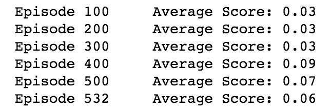
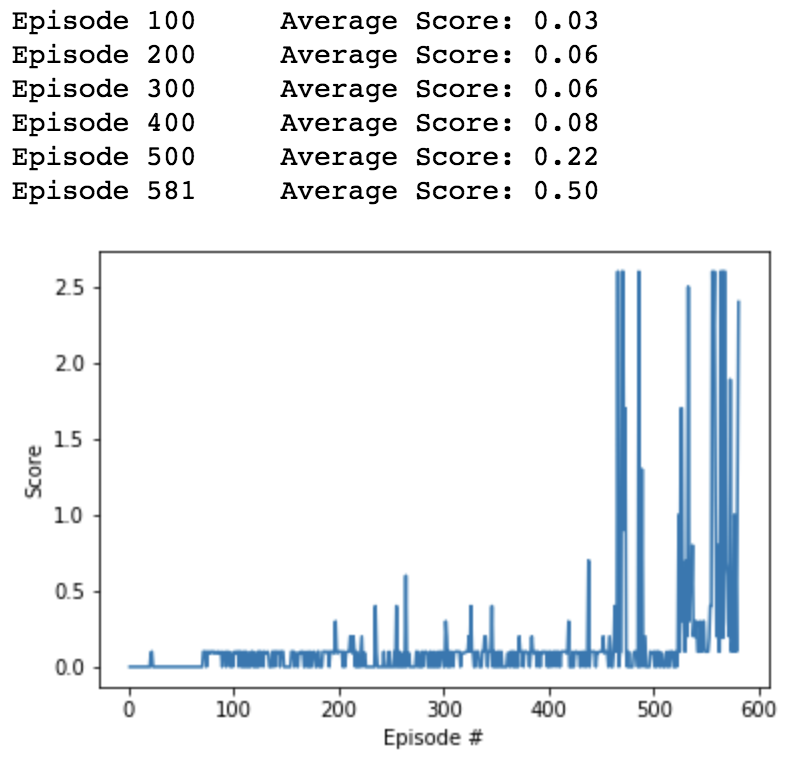

## Report

### Learning Algorithim

The algorithim comes from this [paper](https://arxiv.org/pdf/1509.02971.pdf) and is described via pseudo code in the image below:

### Model Archetecture

Initially I recyled code from the continous control project but the agent was unable to solve the environment. After a few attempts, I removed batch normalization. 

*model* archetecture used 3 layers for the Actor:

        self.fc1 = nn.Linear(state_size, fc1_units)
        self.fc2 = nn.Linear(fc1_units, fc2_units)
        self.fc3 = nn.Linear(fc2_units, action_size)
        
        x = F.relu(self.fc1(state))
        x = F.relu(self.fc2(x))
        return F.tanh(self.fc3(x))
        
and in the Critic:

        self.fcs1 = nn.Linear(state_size, fcs1_units)
        self.fc2 = nn.Linear(fcs1_units+action_size, fc2_units)
        self.fc3 = nn.Linear(fc2_units, 1)
        
        xs = F.relu(self.fcs1(state))
        x = torch.cat((xs, action), dim=1)
        x = F.relu(self.fc2(x))
        
        
### Final Hyperparameters

        BUFFER_SIZE = int(1e5)  # replay buffer size
        BATCH_SIZE = 128        # minibatch size
        GAMMA = 0.99            # discount factor
        TAU = 1e-3              # for soft update of target parameters
        LR_ACTOR = 1e-4         # learning rate of the actor 
        LR_CRITIC = 1e-3        # learning rate of the critic
        WEIGHT_DECAY = 0        # L2 weight decay

### Results

I.  Initial Model, fc1_units = 128, fc2_units = 128, fcs1_units=128, fc2_units=128 with LR_ACTOR and LR_CRITIC both set to 2e-4.  Included batch normalization.  Did not achieve an average score of 0.50:

II.  Second Model, fc1_units = 256, fc2_units = 256, fcs1_units=256, fc2_units=256 with Final Hyperparameters, environment solved.  

      

Removing batch normalization was the key change here that got the network to converge on a solution to the environment.
        
### Future Work

Test different Agents like PPO, A3C or D4PG with the second Version of the Reacher environment.
